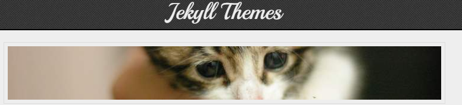

## 어쩌다가 블로그를

과제에 시달리던 어느날... 글을 쓰고 싶다는 생각을 하다가 결국 계속 미뤄 오던 블로그를 시작하기로 마음먹었습니다.

일단 velog, tistory, github pages 등 여러 가지 선택지가 있지만, 좀 더 자유도가 높고 공부를 계속 하면서 발전시킬 수 있는 github pages를 선택했습니다.

사실은 그중에 github pages가 제일 있어 보이기도 했습니다.

## 초기 세팅

처음 [github pages 홈페이지](https://pages.github.com/)에 들어가면 굉장히 기본적인, index.html에 "Hello, world!"라고 쓰는 게 전부인 홈페이지를 만드는 법을 알려 줍니다.

사실 그 화면을 보고 굉장히 당황한 저는, 도망칠 뻔했지만 가까스로 마음을 부여잡고 조사를 해 본 끝에 jekyll이라는 정적 홈페이지 생성기를 주로 사용한다는 점과, 굉장히 많은 테마들이 있다는 사실을 알게 되었습니다.

_테마 홈페이지_

암튼 여기서 [Chirpy](https://chirpy.cotes.page/)라는 훌륭한 테마를 찾았고, [여기](https://chirpy.cotes.page/posts/getting-started/)에 나오는 대로 따라하다 보면 여러분이 보시는 것과 같은 블로그가 나옵니다.

## 개발 환경 세팅
블로그에 글을 쓰고 매번 배포하여 결과를 보는 것은 비효율적이기도 하고, 방문자들이 덜 만들어진 블로그를 볼 수도 있으므로 포스팅을 올린 후의 블로그 모습을 미리 확인할 수 있어야 합니다.

이를 위해 Jekyll 환경을 로컬에서 돌릴 준비를 해야 합니다.
저는 Windows11 wsl2 환경에서 진행했습니다.

자세한 내용은 [링크](https://chirpy.cotes.page/posts/getting-started/)에 잘 설명되어 있으므로 디버깅한 내용을 설명드리자면, 모든 부분이 잘 작동했지만 ruby 버전이 *Chirpy*가 요구하는 것과 달라 (3.1 이상) 다른 버전의 ruby 설치가 필요했고, 아래와 같이 해결했습니다:

1. GPG 인증서 추가

`gpg --keyserver keyserver.ubuntu.com --recv-keys 409B6B1796C275462A1703113804BB82D39DC0E3 7D2BAF1CF37B13E2069D6956105BD0E739499BDB`

2. rvm 설치 (Ruby Version Manager)

`curl -sSL https://get.rvm.io | bash -s stable`

3. Ruby 3.1.0 버전 설치

`rvm install 3.1.0`

4. Ruby 3.1.0 버전 사용

`rvm use 3.1.0`

생각보다 nvm과 비슷한 프로세스를 가지고 있어서 놀랐습니다. 역시 온세상이 웹이야.

사실 프론트엔드 지식이 많지 않아서 걱정을 했지만, 좋은 테마를 찾은 덕에 빠르게 초기 세팅을 끝낸 것 같습니다. 이제 남은 일은 글을 쓰는 일인데... 시간이 더 남는 대로 써서 올리겠습니다.